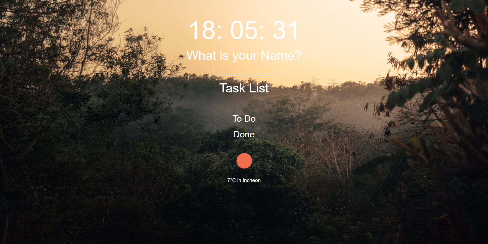
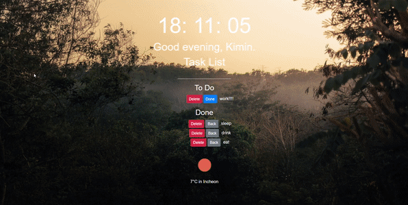

# Momontum 

## <a href="https://inhalin.github.io/momontum/" target="_blank">⏰ Momontum 바로가기</a>

&ensp;

유투버 노마드코더의 <a href="https://nomadcoders.co/javascript-for-beginners/lobby" target="_blank">바닐라JS로 크롬앱 만들기</a>

---

## Features

`🟢 completed` `🟡 in progress` `⚪ not done`

- 🟢 Clock
- 🟢 Todo List
- 🟢 Weather
- 🟢 Random Quote
- 🟢 Random Photo
- 🟢 Offline Support
- 🟡 Viewpage

---

## 동작 이미지

### 랜덤하게 변경되는 배경화면

창을 새로고침 해줄때마다 자동으로 이미지가 랜덤하게 변경된다.

### 투두리스트 추가/삭제

목록에 추가된 아이템들을 버튼을 이용해 `To Do` 리스트와 `Done` 리스트 사이에서 이동하거나 삭제가 가능하다.

