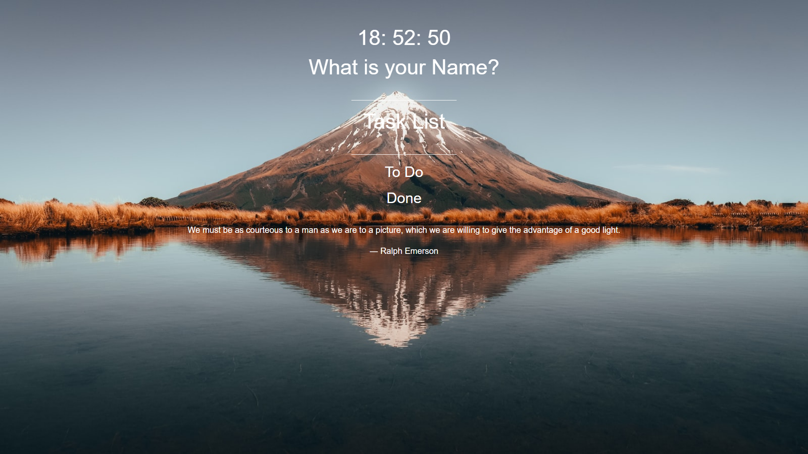

# Momontum 

### [`Momontum 바로가기`](https://inhalin.github.io/Javascript/momontum/momontum.html)

유투버 노마드코더의 [바닐라JS로 크롬앱 만들기 ⏰](https://nomadcoders.co/javascript-for-beginners/lobby)

## Features

- [x] Clock
- [x] Todo List
- [x] Weather
- [x] Random Quote
- [x] Random Photo
- [x] Offline Support
