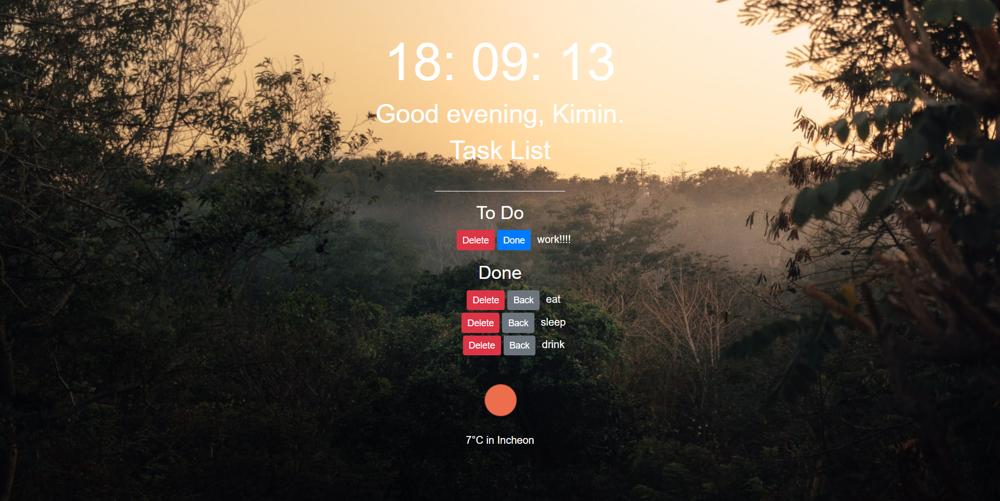

# Momontum 

### [`Momontum 바로가기`](https://inhalin.github.io/momontum/)

유투버 노마드코더의 [바닐라JS로 크롬앱 만들기 ⏰](https://nomadcoders.co/javascript-for-beginners/lobby){: target="_blank"}

## Features

`🟢 completed` `🟡 in progress` `⚪ not done`

- 🟢 Clock
- 🟢 Todo List
- 🟢 Weather
- 🟢 Random Quote
- 🟢 Random Photo
- 🟢 Offline Support
- 🟡 Viewpage

